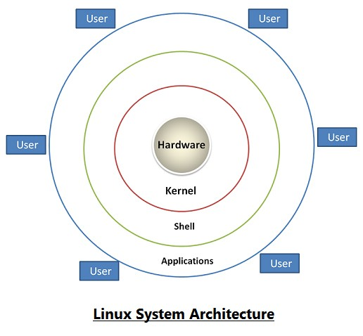
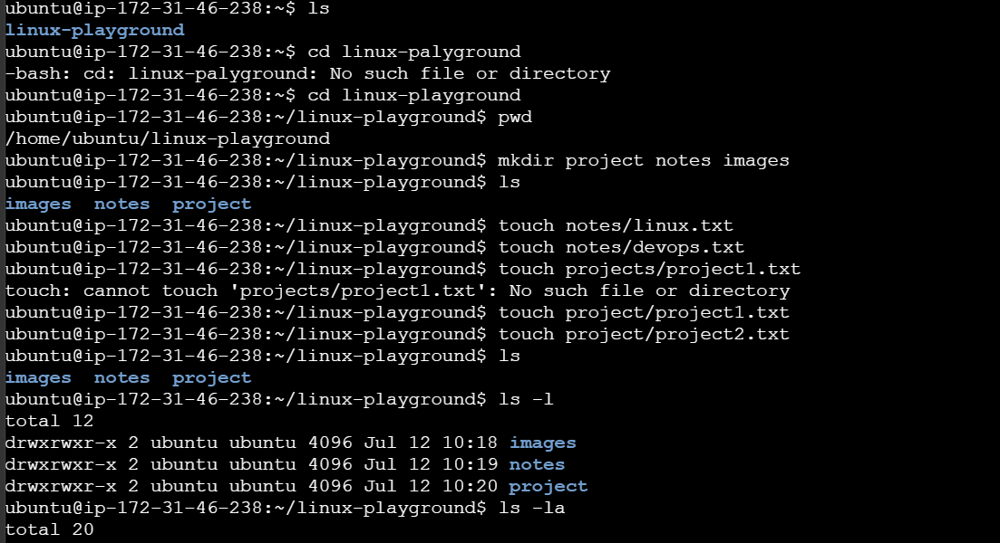
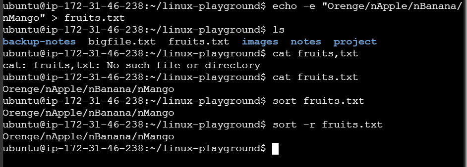
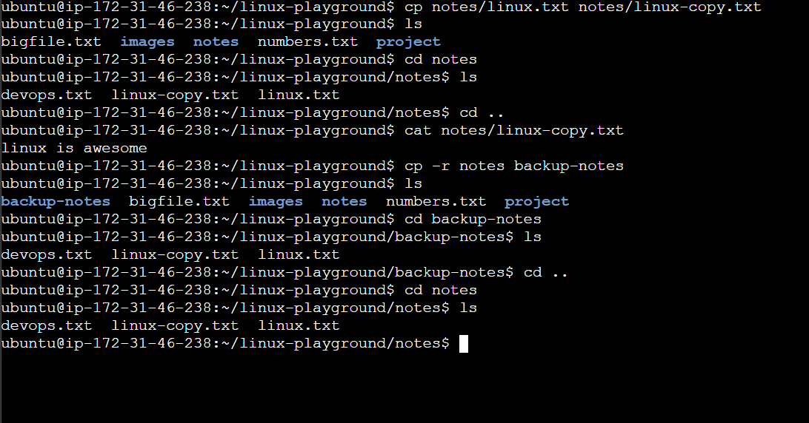

# 🐧 Linux Basics 

## 📌 What is Linux? 

Linux is an **open-source, Unix-like operating system kernel** created by **Linus Torvalds** in 1991. It is widely used in servers, cloud computing, DevOps, embedded systems, and supercomputers due to its **stability, security, and flexibility**. 

---

## 🚀 Why Learn Linux for DevOps?

Most DevOps tools and cloud platforms run on Linux, including: 
- Docker
- Kubernetes
- Jenkins
- Ansible
- AWS EC2 Instances
- Nginx and Apache Web Servers

Linux knowledge is essential for: 
- Managing servers
- Automating tasks
- Monitoring systems
- Troubleshooting production environments

---

## ✨ Features of Linux

- Open Source and Free
- Multiuser Operating System
- Multitasking Support
- Secure and Stable
- Highly Customizable
- Powerful Command-Line Interface (CLI)
- Excellent Networking Capabilities

---
## Linux Architecture



Components
- Kernel: Core of Linux that manages hardware and system resources.
- Shell: Interface between the user and the kernel.
- Applications: Programs such as browsers, editors, and utilities.
- Hardware: CPU, memory, storage, and network devices.
---
## 📂 Important Linux Directories

| Directory | Description |
|-----------|-------------|
| `/` | Root directory. Everything in Linux starts from here. |
| `/home` | Contains personal directories for users. |
| `/root` | Home directory of the root (administrator) user. |
| `/etc` | Stores system configuration files. |
| `/bin` | Essential user commands like `ls`, `cp`, `mv`, `cat`. |
| `/sbin` | System administration commands like `fdisk`, `reboot`. |
| `/usr` | User applications, libraries, and documentation. |
| `/var` | Variable data such as logs, cache, and mail files. |
| `/tmp` | Temporary files created by applications and users. |
| `/dev` | Represents hardware devices as files (disks, terminals, USB devices). |
| `/proc` | Virtual file system containing process and kernel information. |
| `/boot` | Files required to boot the Linux operating system. |
| `/lib` | Essential shared libraries required by system programs. |
| `/opt` | Optional third-party software and applications. |
| `/mnt` | Temporary mount point for file systems and devices. |
| `/media` | Mount point for removable devices like USB drives and CDs. |

---

## 💻 Basic Linux Commands

| Command | Description |
|---------|-------------|
| `pwd` | Display the current working directory |
| `ls` | List files and directories |
| `ls -l` | List files in long format |
| `ls -la` | List all files, including hidden files |
| `cd directory_name` | Change to a specific directory |
| `cd ..` | Move to the parent directory |
| `cd ~` | Move to the home directory |
| `mkdir directory_name` | Create a new directory |
| `touch file_name` | Create an empty file |
| `cat file_name` | Display the contents of a file |
| `clear` | Clear the terminal screen |
| `whoami` | Display the current username |
| `hostname` | Display the system hostname |
| `date` | Display the current date and time |
| `man command` | Display the manual page of a command |

### Examples

```bash
pwd
ls
ls -la
cd Documents
cd ..
mkdir devops
touch notes.txt
cat notes.txt
whoami
hostname
date
clear
man ls
```

## Hands On Practice (ScreenShots)

```text
cd
mkdir
ls
ls -l
ls -la
touch
```


```text
echo
cat , zcat
sort
sort -r
```



```text
cp
cp -r
cd ..
```


## Note:

Bellow All this Commands I learn & Undersatand with *Hands-on-practice*  but unfortunately i am not adding screenshots for some reason!! 

```text
pwd
cd ~ 
mv
mv -r
clear
rm
rm -r
ln (hardlink)
ln -s (softlink)
wc (word Count) , wc -l, wc -w
less
more
head
tail, tail -f
cut
tree

```
