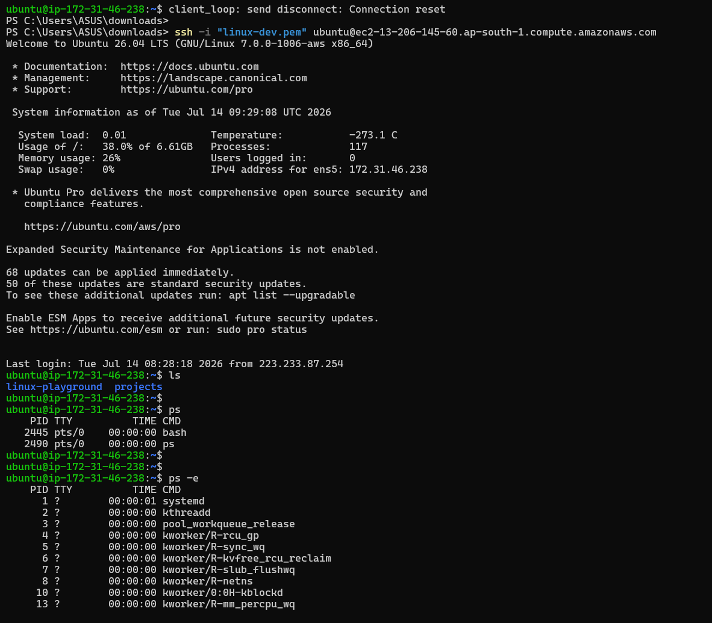
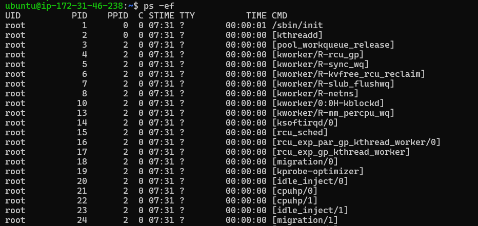

# ⚙️ Linux Process Management

Process management is an essential Linux administration skill that allows you to monitor, control, and manage running applications and services efficiently. DevOps Engineers use these commands daily to troubleshoot applications, optimize system performance, and manage production servers.

---

## 📚 Topics Covered

| Command | Description |
| :--- | :--- |
| **`ps`** | Display information about currently running processes. |
| **`top`** | Monitor running processes and system resource usage in real time. |
| **`kill`** | Terminate a running process using its Process ID (PID). |
| **`killall`** | Terminate all processes with a specified name. |
| **`pkill`** | Kill processes by name or other matching criteria. |
| **`nohup`** | Run a command in the background so it continues after logout. |
| **`jobs`** | Display background jobs in the current shell. |
| **`bg`** | Resume a suspended job in the background. |
| **`fg`** | Bring a background job to the foreground. |
| **`fuser`** | Identify which process is using a file, directory, or network port. |

---

## 🖥️ ps (Process Status)

Displays snapshots of information about active processes.

### Syntax
```bash
ps [options]
```

### Examples
```bash
# Show processes for the current shell session
ps

# Show all running processes on the system
ps -e

# Display detailed, full-format information about all running processes
ps -ef

# Show processes owned by a specific user
ps -u username
```

---

## Hands-On-Practice




## 📊 top

Displays running processes along with dynamic, real-time views of CPU, memory, and overall system usage.

### Syntax
```bash
top
```

### Shortcuts
* Press `q` to exit the interactive session.

---

## ❌ kill

Terminates a running process gracefully or forcefully using its Process ID (PID).

### Syntax
```bash
kill [options] PID
```

### Examples
```bash
# Gracefully terminate a process (Sends SIGTERM)
kill 1234

# Forcefully terminate an unresponsive process (Sends SIGKILL)
kill -9 1234
```

---

## 🔄 nohup

Runs a command immune to hangups, allowing it to run in the background even after you log out.

### Syntax
```bash
nohup command &
```

### Example
```bash
nohup python3 app.py &
```
> **Note:** Standard output is redirected and saved to a file named `nohup.out` by default.

---


