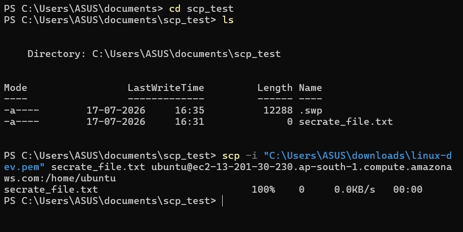
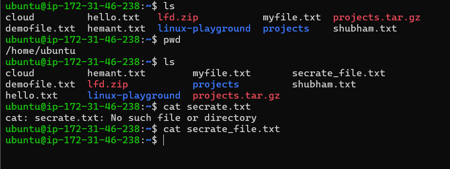
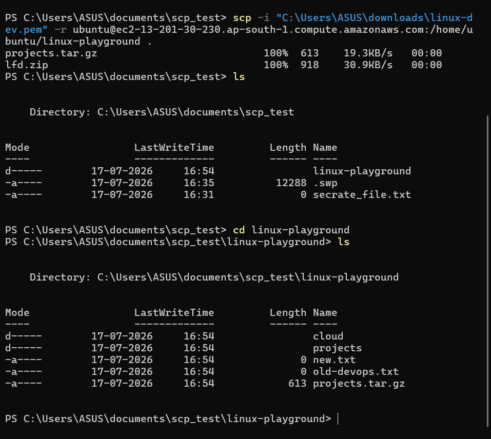

# 🌐 Linux Networking Commands

Networking is one of the most important areas of Linux system administration and DevOps. These commands help administrators connect to remote servers, troubleshoot network issues, verify connectivity, and transfer files securely.

---

## 📚 Topics Covered

| Command | Description |
|----------|-------------|
| **SSH (Secure Shell)** | Securely connect to and manage remote Linux servers. |
| **Ping** | Test network connectivity between your system and another host. |
| **Hostname** | Display or configure the system's hostname. |
| **IP (`ip`)** | View and manage IP addresses, network interfaces, and routing information. |
| **ifconfig** | Display and configure network interface settings (legacy command). |
| **netstat** | Display network connections, routing tables, and listening ports (legacy command). |
| **ss** | Display socket statistics and active network connections (modern replacement for `netstat`). |
| **traceroute** | Trace the path packets take to reach a destination host. |
| **nslookup** | Query DNS servers to resolve domain names into IP addresses. |
| **dig** | Perform detailed DNS lookups and troubleshoot DNS-related issues. |
| **curl** | Transfer data to or from a server using various network protocols (commonly HTTP/HTTPS). |
| **wget** | Download files from the internet via HTTP, HTTPS, or FTP. |
| **scp** | Securely copy files between local and remote Linux systems over SSH. |
| **rsync** | Synchronize files and directories efficiently between local and remote systems. |

---

# 🔐 SSH (Secure Shell)

SSH is a secure protocol used to remotely access Linux servers over a network.

### Syntax

```bash
ssh username@server_ip
```

### Example

```bash
ssh ubuntu@192.168.1.100
```

### Connect using a Private Key

```bash
ssh -i ~/.ssh/id_rsa ubuntu@192.168.1.100
```

### Exit SSH Session

```bash
exit
```

### Generate SSH Key Pair

```bash
ssh-keygen
```

### Copy Public Key to Remote Server

```bash
ssh-copy-id username@server_ip
```

### Common SSH Options

| Command | Description |
|----------|-------------|
| `ssh user@host` | Connect to remote server |
| `ssh -p 2222 user@host` | Connect using custom port |
| `ssh -i key.pem user@host` | Use private key |
| `exit` | Close SSH session |

---

## Hands-On-Practice


☝️ This image displays a terminal window showing a user successfully connecting to a remote AWS EC2 Linux server from a Windows host using PowerShell.

Here is a structured breakdown of the steps and details visible in the image:

1. Local Navigation & File Verification :
- Command
```bash
cd downloads
```
> The user navigates into the local Windows downloads directory.
- Command
```bash
ls linux-dev.pem
```
> The user verifies that the private key file (linux-dev.pem), required for AWS authentication, is present in the folder.


2. File Permissions & SSH Connection :
- Command
```bash
chmod 400 "linux-dev.pem
```
> The user attempts to restrict file permissions on the key file (a standard requirement for SSH keys to prevent them from being too publicly accessible).

- Command
```bash
ssh -i "linux-dev.pem" ubuntu@://amazonaws.com
```
> The user executes the SSH command to connect securely as the ubuntu user to an AWS EC2 instance located in the Mumbai region (ap-south-1).

3. Remote Server Welcome & System Banner
> The connection is successful, and the terminal displays the Ubuntu 26.04 LTS (GNU/Linux 7.0.0-1006-aws x86_64) welcome banner alongside real-time system metrics:
- System Load: 0.0
- Disk Usage: 31.5% of 6.61GB
- Memory Usage: 25%
- Private IP Address: 172.31.46.238

4. Active Remote Prompt

> The last line shows the terminal prompt switching from Windows PowerShell to the remote Linux bash prompt: ubuntu@ip-172-31-46-238:~$, indicating that the user is now ready to run commands directly on the cloud server.


---

# 📂 SCP (Secure Copy Protocol)

## 📖 What is SCP?

**SCP (Secure Copy Protocol)** is a command-line utility used to securely transfer files and directories between:

- Local machine ➜ Remote server
- Remote server ➜ Local machine
- Remote server ➜ Remote server

SCP uses **SSH (Secure Shell)** for authentication and encryption, making file transfers secure.

---

## 🔹 Syntax

```bash
scp [options] source destination
```

---

# 📥 Copy Local File to Remote Server

### Syntax

```bash
scp -i key.pem file.txt username@server_ip:/path/
```


### Example

```bash
scp -i linux-dev.pem notes.txt ubuntu@192.168.1.10:/home/ubuntu/
```

### Explanation

| Part | Meaning |
|------|----------|
| scp | Secure Copy command |
| -i linux-dev.pem | SSH private key |
| notes.txt | Local file |
| ubuntu | Remote username |
| 192.168.1.10 | Remote server IP |
| /home/ubuntu/ | Destination directory |

---


# 📤 Copy Remote File to Local Machine

### Syntax

```bash
scp -i key.pem username@server_ip:/path/file.txt .
```

### Example

```bash
scp -i linux-dev.pem ubuntu@192.168.1.10:/home/ubuntu/log.txt .
```

`.` means the current directory.

---


# 📤 Copy Remote File to Local Machine

### Syntax

```bash
scp -i key.pem username@server_ip:/path/file.txt .
```

### Example

```bash
scp -i linux-dev.pem ubuntu@192.168.1.10:/home/ubuntu/log.txt .
```

`.` means the current directory.

---

# 📁 Copy Directory to Remote Server

Use the **-r** option.

```bash
scp -r -i linux-dev.pem project ubuntu@192.168.1.10:/home/ubuntu/
```

---

# 📁 Copy Directory from Remote Server

```bash
scp -r -i linux-dev.pem ubuntu@192.168.1.10:/home/ubuntu/project .
```

---

# 🔧 Useful Options

| Option | Description |
|---------|-------------|
| -i | Identity (private key) |
| -r | Copy directories recursively |
| -P | Specify SSH port |
| -v | Verbose output |
| -C | Compress data during transfer |

Example:

```bash
scp -P 2222 file.txt ubuntu@192.168.1.10:/home/ubuntu/
```

---


# 🌍 Real-World DevOps Use Cases

✅ Upload application files to an EC2 instance

```bash
scp -i linux-dev.pem app.jar ubuntu@ec2-ip:/home/ubuntu/
```

---

✅ Upload deployment scripts

```bash
scp -i linux-dev.pem deploy.sh ubuntu@ec2-ip:/home/ubuntu/
```

---

✅ Download server logs

```bash
scp -i linux-dev.pem ubuntu@ec2-ip:/var/log/syslog .
```

---

✅ Copy configuration files

```bash
scp -i linux-dev.pem nginx.conf ubuntu@ec2-ip:/etc/nginx/
```

---

# Hands-on-Practice





- In Above images i am sending local file called "secrate_file.txt" sending to remote server using SCP (Secure Copy)
---




- In Above Image i am sending directory called "linux-playground" from remote sever to Local system using SCP


---

# 💡 Best Practices

- Never share your private key (`.pem`).
- Use SSH key authentication instead of passwords.
- Verify the destination path before copying.
- Use `-r` only when copying directories.
- Keep private key permissions secure (`chmod 400 key.pem` on Linux).

---

# 📝 Summary

- SCP securely copies files using SSH.
- Supports local ↔ remote and remote ↔ remote transfers.
- Works with files and directories.
- Commonly used in DevOps for deployments, backups, and log retrieval.


---

## 📖 What is Ping?

**Ping (Packet Internet Groper)** is a network diagnostic command used to check whether a remote host (server, website, or device) is reachable over a network.

It sends **ICMP (Internet Control Message Protocol) Echo Request** packets to the destination and waits for **Echo Reply** packets. Based on the response, it measures network connectivity and latency.

---

## 🎯 Why Use Ping?

- Verify network connectivity.
- Check if a server or website is reachable.
- Measure network latency (response time).
- Troubleshoot network-related issues.
- Test communication between devices.

---

## 📝 Syntax

```bash
ping [options] <hostname_or_ip>
```

---

## 🚀 Basic Examples

### 1. Ping a Website

```bash
ping google.com
```

Example Output:

```text
PING google.com (142.250.193.78) 56(84) bytes of data.
64 bytes from 142.250.193.78: icmp_seq=1 ttl=117 time=22.5 ms
64 bytes from 142.250.193.78: icmp_seq=2 ttl=117 time=21.8 ms
```

---

### 2. Ping an IP Address

```bash
ping 8.8.8.8
```

This checks whether Google's public DNS server is reachable.

---

### 3. Send Only 4 Packets

```bash
ping -c 4 google.com
```

Output stops automatically after sending four packets.

---

### 4. Specify Packet Size

```bash
ping -s 100 google.com
```

Sends packets with a size of 100 bytes.

---

### 5. Set Time Interval Between Packets

```bash
ping -i 2 google.com
```

Sends one packet every 2 seconds.

---


### 6. Ping IPv6 Address

```bash
ping6 google.com
```

or

```bash
ping -6 google.com
```

---

## 📋 Common Options

| Option | Description |
|---------|-------------|
| `-c` | Send a specific number of packets |
| `-i` | Set interval between packets |
| `-s` | Specify packet size |
| `-4` | Use IPv4 only |
| `-6` | Use IPv6 only |
| `-W` | Set timeout for reply |
| `-q` | Quiet output (summary only) |
| `-f` | Flood ping (requires privileges) |

---

## 📊 Understanding Ping Output

Example:

```text
64 bytes from 142.250.193.78: icmp_seq=1 ttl=117 time=20.4 ms
```

| Field | Meaning |
|-------|---------|
| `64 bytes` | Size of the received packet |
| `icmp_seq=1` | Sequence number of the packet |
| `ttl=117` | Time To Live value |
| `time=20.4 ms` | Round-trip response time |

---


## 🌍 Real-World DevOps Use Cases

### ✅ Check if a Server is Reachable

```bash
ping 192.168.1.100
```

---

### ✅ Verify Internet Connectivity

```bash
ping google.com
```

---

### ✅ Test Connectivity to a DNS Server

```bash
ping 8.8.8.8
```

---


### ✅ Troubleshoot Network Issues

If a website is not opening, use:

```bash
ping example.com
```

If there is no response, the issue could be:
- Network connection
- DNS resolution
- Firewall
- Server downtime

---

## 💡 Best Practices

- Use `ping -c 4` instead of continuous ping during testing.
- Test both a hostname and an IP address to identify DNS issues.
- A successful ping does not guarantee that all services (HTTP, SSH, etc.) are working.
- Some servers disable ICMP replies, so a failed ping does not always mean the server is down.

---


## 📚 Summary

- `ping` is used to test network connectivity.
- It uses ICMP Echo Request and Echo Reply packets.
- It helps measure latency and identify connectivity problems.
- It is one of the most commonly used Linux networking commands for troubleshooting.

---

# 🔹 hostname

## Purpose
Displays the current hostname.

### Example

```bash
hostname
```

Set a temporary hostname

```bash
sudo hostname dev-server
```

---

# 🔹hostnamectl

## Purpose
Displays and manages hostname information.

### Show hostname

```bash
hostnamectl
```

Change hostname permanently

```bash
sudo hostnamectl set-hostname dev-server
```

---

# 🔹ip

## Purpose
Modern networking command used instead of ifconfig.

Show IP address

```bash
ip addr
```

Show routing table

```bash
ip route
```

Show network interfaces

```bash
ip link
```

---

# 🔹 ifconfig

## Purpose
Legacy command to view network interfaces.

```bash
ifconfig
```

> Note: Install net-tools if the command is unavailable.

Ubuntu

```bash
sudo apt install net-tools
```

---


# 🔹 ss

## Purpose
Shows active TCP/UDP connections and listening ports.

Show listening ports

```bash
ss -tuln
```

Show all connections

```bash
ss -a
```

---

# 🔹 netstat

## Purpose
Displays network statistics.

Show listening ports

```bash
netstat -tuln
```

Show routing table

```bash
netstat -r
```

---


# 🔹traceroute

## Purpose
Shows the path packets travel.

```bash
traceroute google.com
```

Install

Ubuntu

```bash
sudo apt install traceroute
```

---

# 🔹 nslookup

## Purpose
Resolves domain names using DNS.

```bash
nslookup google.com
```

Lookup using a specific DNS server

```bash
nslookup google.com 8.8.8.8
```

---
