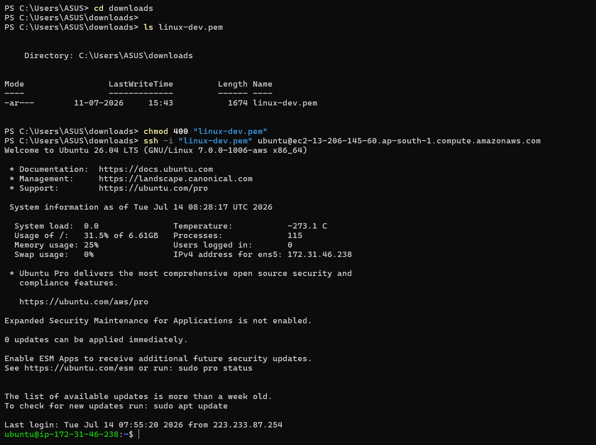

# 🌐 Linux Networking Commands

Networking is one of the most important areas of Linux system administration and DevOps. These commands help administrators connect to remote servers, troubleshoot network issues, verify connectivity, and transfer files securely.

---

## 📚 Topics Covered

| Command | Description |
|----------|-------------|
| **SSH (Secure Shell)** | Securely connect to and manage remote Linux servers. |
| **Ping** | Test network connectivity between your system and another host. |
| **Hostname** | Display or configure the system's hostname. |
| **IP (`ip`)** | View and manage IP addresses, network interfaces, and routing information. |
| **ifconfig** | Display and configure network interface settings (legacy command). |
| **netstat** | Display network connections, routing tables, and listening ports (legacy command). |
| **ss** | Display socket statistics and active network connections (modern replacement for `netstat`). |
| **traceroute** | Trace the path packets take to reach a destination host. |
| **nslookup** | Query DNS servers to resolve domain names into IP addresses. |
| **dig** | Perform detailed DNS lookups and troubleshoot DNS-related issues. |
| **curl** | Transfer data to or from a server using various network protocols (commonly HTTP/HTTPS). |
| **wget** | Download files from the internet via HTTP, HTTPS, or FTP. |
| **scp** | Securely copy files between local and remote Linux systems over SSH. |
| **rsync** | Synchronize files and directories efficiently between local and remote systems. |

---

# 🔐 SSH (Secure Shell)

SSH is a secure protocol used to remotely access Linux servers over a network.

### Syntax

```bash
ssh username@server_ip
```

### Example

```bash
ssh ubuntu@192.168.1.100
```

### Connect using a Private Key

```bash
ssh -i ~/.ssh/id_rsa ubuntu@192.168.1.100
```

### Exit SSH Session

```bash
exit
```

### Generate SSH Key Pair

```bash
ssh-keygen
```

### Copy Public Key to Remote Server

```bash
ssh-copy-id username@server_ip
```

### Common SSH Options

| Command | Description |
|----------|-------------|
| `ssh user@host` | Connect to remote server |
| `ssh -p 2222 user@host` | Connect using custom port |
| `ssh -i key.pem user@host` | Use private key |
| `exit` | Close SSH session |

---

## Hands-On-Practice



☝️ This image displays a terminal window showing a user successfully connecting to a remote AWS EC2 Linux server from a Windows host using PowerShell.

Here is a structured breakdown of the steps and details visible in the image:

1. Local Navigation & File Verification :
- Command
```bash
cd downloads
```
> The user navigates into the local Windows downloads directory.
- Command
```bash
ls linux-dev.pem
```
> The user verifies that the private key file (linux-dev.pem), required for AWS authentication, is present in the folder.


2. File Permissions & SSH Connection :
- Command
```bash
chmod 400 "linux-dev.pem
```
> The user attempts to restrict file permissions on the key file (a standard requirement for SSH keys to prevent them from being too publicly accessible).

- Command
```bash
ssh -i "linux-dev.pem" ubuntu@://amazonaws.com
```
> The user executes the SSH command to connect securely as the ubuntu user to an AWS EC2 instance located in the Mumbai region (ap-south-1).

3. Remote Server Welcome & System Banner
> The connection is successful, and the terminal displays the Ubuntu 26.04 LTS (GNU/Linux 7.0.0-1006-aws x86_64) welcome banner alongside real-time system metrics:
- System Load: 0.0
- Disk Usage: 31.5% of 6.61GB
- Memory Usage: 25%
- Private IP Address: 172.31.46.238

4. Active Remote Prompt

> The last line shows the terminal prompt switching from Windows PowerShell to the remote Linux bash prompt: ubuntu@ip-172-31-46-238:~$, indicating that the user is now ready to run commands directly on the cloud server.


---

# 📂 SCP (Secure Copy Protocol)

## 📖 What is SCP?

**SCP (Secure Copy Protocol)** is a command-line utility used to securely transfer files and directories between:

- Local machine ➜ Remote server
- Remote server ➜ Local machine
- Remote server ➜ Remote server

SCP uses **SSH (Secure Shell)** for authentication and encryption, making file transfers secure.

---

## 🔹 Syntax

```bash
scp [options] source destination
```

---

# 📥 Copy Local File to Remote Server

### Syntax

```bash
scp -i key.pem file.txt username@server_ip:/path/
```


### Example

```bash
scp -i linux-dev.pem notes.txt ubuntu@192.168.1.10:/home/ubuntu/
```

### Explanation

| Part | Meaning |
|------|----------|
| scp | Secure Copy command |
| -i linux-dev.pem | SSH private key |
| notes.txt | Local file |
| ubuntu | Remote username |
| 192.168.1.10 | Remote server IP |
| /home/ubuntu/ | Destination directory |

---


# 📤 Copy Remote File to Local Machine

### Syntax

```bash
scp -i key.pem username@server_ip:/path/file.txt .
```

### Example

```bash
scp -i linux-dev.pem ubuntu@192.168.1.10:/home/ubuntu/log.txt .
```

`.` means the current directory.

---


# 📤 Copy Remote File to Local Machine

### Syntax

```bash
scp -i key.pem username@server_ip:/path/file.txt .
```

### Example

```bash
scp -i linux-dev.pem ubuntu@192.168.1.10:/home/ubuntu/log.txt .
```

`.` means the current directory.

---

# 📁 Copy Directory to Remote Server

Use the **-r** option.

```bash
scp -r -i linux-dev.pem project ubuntu@192.168.1.10:/home/ubuntu/
```

---

# 📁 Copy Directory from Remote Server

```bash
scp -r -i linux-dev.pem ubuntu@192.168.1.10:/home/ubuntu/project .
```

-
