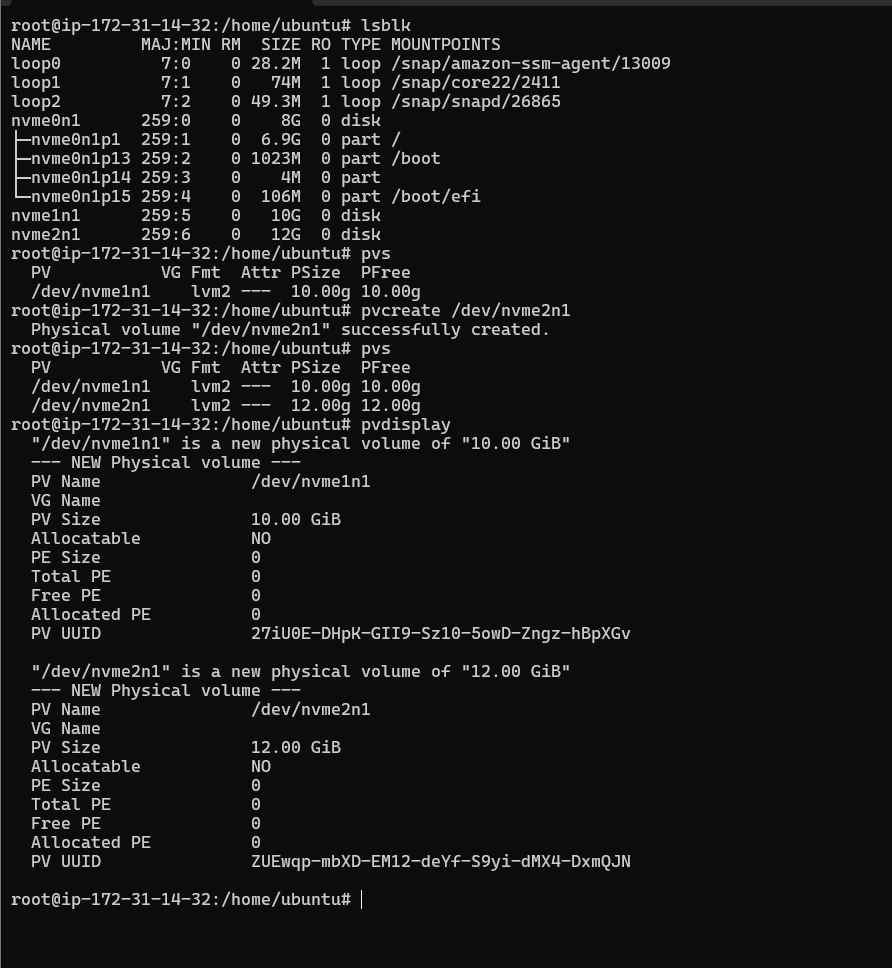
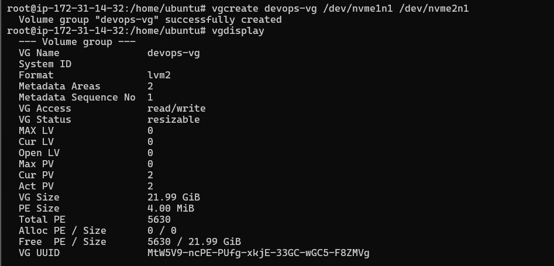

# 💾 Linux Volume Management (LVM)


This section covers Linux Logical Volume Management (LVM), which allows flexible disk management by creating, resizing, and managing logical storage volumes without repartitioning disks.

---


## 📚 Topics Covered

| Topic | Description |
|--------|-------------|
| Physical Volume (PV) | Converts disks or partitions into LVM storage |
| Volume Group (VG) | Combines multiple physical volumes into one storage pool |
| Logical Volume (LV) | Creates virtual partitions from a volume group |
| Create LVM | Create PV, VG, and LV |
| Extend LVM | Increase logical volume size |
| Reduce LVM | Shrink logical volume safely |
| Resize Filesystem | Extend or reduce filesystem after LV changes |
| Display Information | View PV, VG, and LV details |
| Remove LVM | Delete logical volumes, groups, and physical volumes |

---

## 📂 LVM Architecture

```
Hard Disk
   │
   ▼
+----------------+
| Physical Volume|
|     (PV)       |
+----------------+
        │
        ▼
+----------------+
| Volume Group   |
|     (VG)       |
+----------------+
        │
        ▼
+----------------+
| Logical Volume |
|     (LV)       |
+----------------+
        │
        ▼
Filesystem
(ext4 / xfs)
```

---

## 🔥 Common Commands

| Command | Description |
|----------|-------------|
| `pvcreate /dev/sdb` | Create Physical Volume |
| `pvdisplay` | Show PV information |
| `vgcreate data_vg /dev/sdb` | Create Volume Group |
| `vgdisplay` | Show VG information |
| `lvcreate -L 5G -n data_lv data_vg` | Create Logical Volume |
| `lvdisplay` | Show LV information |
| `mkfs.ext4 /dev/data_vg/data_lv` | Create filesystem |
| `mount /dev/data_vg/data_lv /mnt/data` | Mount logical volume |
| `lvextend -L +2G /dev/data_vg/data_lv` | Extend LV |
| `resize2fs /dev/data_vg/data_lv` | Resize ext4 filesystem |
| `lvreduce -L 4G /dev/data_vg/data_lv` | Reduce LV |
| `lvremove /dev/data_vg/data_lv` | Remove Logical Volume |
| `vgremove data_vg` | Remove Volume Group |
| `pvremove /dev/sdb` | Remove Physical Volume |

---

## 🛠 Hands-on Practice

- Create a Physical Volume


- Create a Volume Group


- Create a Logical Volume
- Format with ext4
- Mount the Logical Volume
- Extend the Logical Volume
- Resize the filesystem
- Remove the Logical Volume

---
